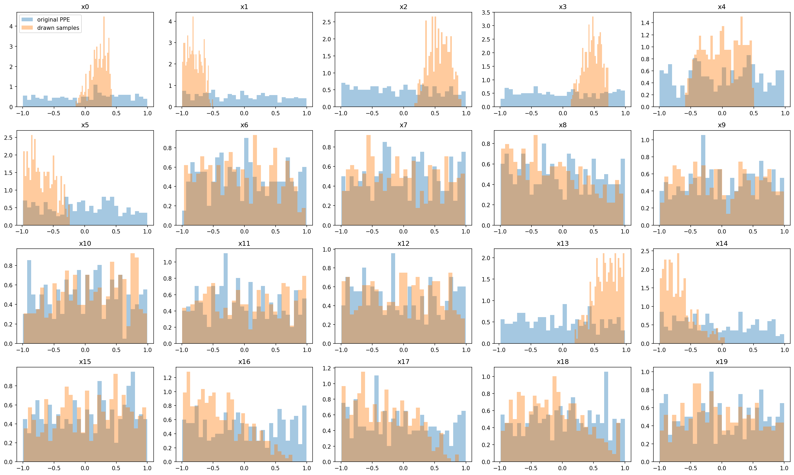
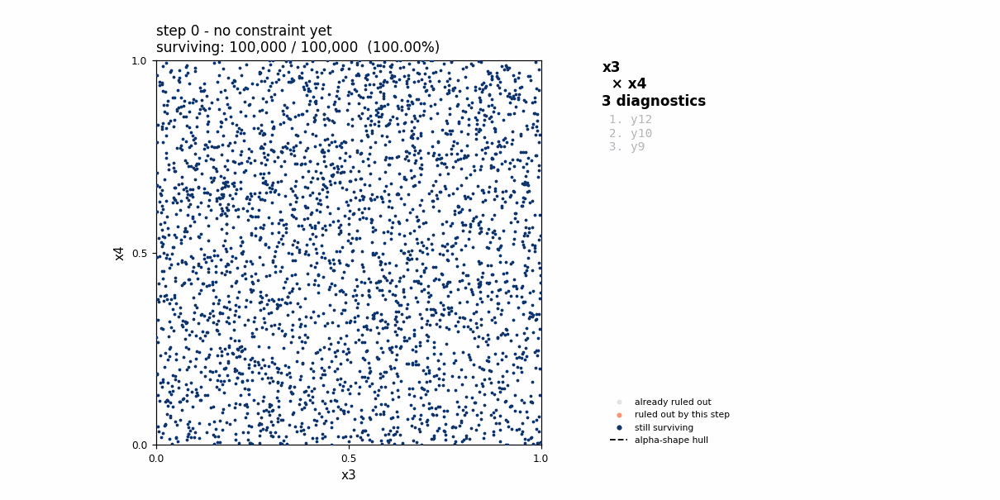
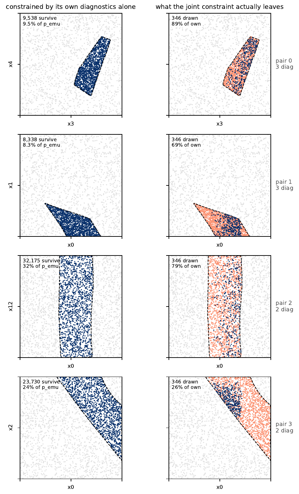

# proj2dhullsampler

**Find the parameter values of a model that are consistent with observations,
using a perturbed parameter ensemble (PPE) and simple 2-D pictures.**

You give the package:

- a PPE: parameter values and model output for each ensemble member, and
- observations of the same quantities.

It returns a set of new parameter values (real units, CSV and NetCDF) that are
consistent with *all* the observations it could trust, plus figures that show
why each parameter ended up where it did.

<p align="center">
  
</p>

*Result for the synthetic linear example (`data/linear_example`, 20 parameters,
30 outputs). Blue: the original PPE. Orange: the parameter sets drawn by the
method. Parameters that the outputs constrain (e.g. `x0`,
`x1`, `x2`, `x3`, `x5`, `x13`, `x14`) collapse around their true values
(`x0 = 0.34`, `x1 = -0.89`, `x2 = 0.67`, `x3 = 0.62`, `x5 = -0.78`, ...); the
others stay close to the original spread.*

---

## Contents

1. [How the method works](#how-the-method-works)
2. [Quick start](#quick-start)
3. [Configuring a run](#configuring-a-run)
4. [What you get](#what-you-get)
5. [Repository layout](#repository-layout)
6. [Development and testing](#development-and-testing)

---

## How the method works

All parameters are rescaled to 0-1 with the PPE minimum and maximum.

### 1. Pairwise constraints: one 2-D region per parameter pair

For every scalar diagnostic (e.g. "zonal-mean precipitation, 30-40N"):

1. Find the **two parameters it is most sensitive to**.
2. Train a Gaussian-process **emulator** on those two parameters.
3. Evaluate it on many random parameter sets. A set **passes** if the
   observation lies within the emulator's mean ± *k* standard deviations
   (`threshold_level`).

Diagnostics that share the same parameter pair are combined: a point must pass
all of them. The passing points form a region in that pair's square, outlined by
an alpha-shape hull.

<p align="center">
  
</p>

*Pair `x3`-`x4` in the linear example. Its three diagnostics are switched on one
at a time. Dark blue: still allowed. Orange: ruled out by the diagnostic just
added. Grey: already ruled out. Dashed line: the hull used for sampling. In the
end 9.5% of the square is allowed.*

### 2. Interlock: all pairs at once

A full parameter set is acceptable only if it lies **inside every pair's
region at the same time**. Pairs share parameters (`x0` appears in `x0-x1`,
`x0-x12` and `x0-x2`), so a limit found in one pair also squeezes the others.

The sampler draws uniform random points in the full parameter space and keeps
only those that fall inside all hulls. Pairs are added one by one, the pairs
with the most diagnostics first.

<p align="center">
  
</p>

*First 4 of 16 pairs (full figure: `figs/constraint_interlock.pdf`). Left: the
region each pair allows on its own. Right: orange is that same region, and dark
blue are the parameter sets finally drawn. In the bottom row, pair `x0-x2` alone
allows 24% of its square, but the drawn samples cover only a quarter of that,
because `x0` is already restricted by the pairs above it (`x0-x1`, `x0-x12`).*

### 3. Excluding structural error

Some observations cannot be matched by *any* parameter values: the model (or the
observation) has a structural error. Forcing the method to fit them would push
the parameters to wrong values or leave no samples at all. Such diagnostics are
therefore removed, at three levels:

| Level | Symptom | Action | Config keys | Listed as |
|---|---|---|---|---|
| **Single diagnostic** | Almost no parameter set passes it. (Diagnostics that *every* set passes are also removed, because they constrain nothing.) Emulator cannot reproduce the PPE. | Drop the diagnostic | `n_survive_threshold`, `emultor_error_ratio_threshold`, `vars_to_drop` (by hand) | `tight`, `useless`, `by_emulator_performance`, `by_name` |
| **Within a pair** | Diagnostics of the same pair allow regions that (almost) do not overlap, so they cannot all be right | Drop the diagnostic most involved in the conflict, repeat until they overlap | `n_survive_threshold_2d`, `added_number_for_pairs` | `nooverlap2d` |
| **Across pairs** | Adding a pair removes nearly every parameter set allowed by the earlier pairs | Keep only a subset of that pair's diagnostics, or skip the pair | `threshold_ratio_between_para_pairs` | `during_iteration` |

Every dropped diagnostic is written to `output/<result_name>_dropped_vars.json`
and drawn in `diagnostics/dropped_vars/`, so you can see what it would have said.

---

## Quick start

The method runs as a **PBS batch job** (`qsub`).

### 1. Install

Python 3.10+:

```bash
pip install -e .          # add [dev] for pytest, ruff, black
```

### 2. Choose a config

`application/` has two ready-made examples:

| Config | Input | Data |
|---|---|---|
| `config_table.json` | CSV tables of scalar diagnostics | `data/linear_example/` (in the repo; a synthetic linear model with known true parameters) |
| `config_nc.json` | NetCDF fields, turned into zonal means and box averages | CAM PPE and satellite observations on NCAR GLADE |

In the config you choose, set `working_dir` to a directory you can write to.
`application/config_annotated.jsonc` explains every key.

### 3. Edit and submit the job script

In `application/submit_apply.pbs`:

- set `#PBS -A` to your project code, and adjust the queue, `select` and
  `walltime`;
- set the `conda activate` line to your environment;
- make the last line point to your config
  (`--config config_table.json` or `--config config_nc.json`).

Then submit, from the repository root or from inside `application/`:

```bash
qsub application/submit_apply.pbs        # or: cd application && qsub submit_apply.pbs
```

Either way the job runs inside `application/`, so the relative data paths in
`config_table.json` resolve to `data/linear_example/`. The job's output goes to
`proj.log` in the directory you submitted from, and a copy of the pipeline log
to `<working_dir>/<case_name>/diagnostics/run_log.txt`.

---

## Configuring a run

See `application/config_annotated.jsonc` for the full list. The keys you will
change most often:

| Key | Meaning |
|---|---|
| `working_dir`, `case_name` | The case lives in `<working_dir>/<case_name>/` |
| `result_name` | Prefix of the result files. Use a new one for each run on the same case |
| `data_paths` | Parameter CSV plus either tables (`ppe_tab`, `obs_tab`) or NetCDF (`ppe_nc`, `obs_nc`), or both |
| `threshold_level` | *k* in "observation within emulator mean ± *k* std". Larger = looser. Must be listed in `prepare_case.threshold_levels` |
| `n_survive_threshold`, `n_survive_threshold_2d` | How few passing points count as "structural error" (per diagnostic / per pair), out of `n_sample` |
| `threshold_ratio_between_para_pairs` | Smallest fraction of samples a new pair may keep before it counts as conflicting |
| `n_max` | Maximum number of parameter sets to return |

### Input formats

- **Parameters** (`para`, always required): CSV, first column = member id,
  one column per parameter.
- **Tables** (`ppe_tab`, `obs_tab`): PPE CSV with the same member ids as rows and
  one column per diagnostic; observation CSV with one row per diagnostic
  (name, value).
- **NetCDF** (`ppe_nc`, `obs_nc`): fields on (member, lat, lon) and (lat, lon).
  `obs_dict` maps model to observation variable names; `lat_bins` and
  `manual_regions` define the zonal bands and boxes that become diagnostics.

### Re-running a case

Emulator training is the slow step, so it is done only once. If
`<working_dir>/<case_name>` already exists, the run **loads** it and only
repeats the steps after emulation. This makes it cheap to try other thresholds:

- change the dropping/sampling keys and use a new `result_name`;
- to try another `threshold_level`, it must already be in
  `prepare_case.threshold_levels` when the case is created;
- if the input data or `n_sample` change, use a new `case_name`.

A re-run overwrites the figures and `run_log.txt` in `diagnostics/`.

---

## What you get

```text
<working_dir>/<case_name>/
├── output/
│   ├── <result_name>_all_para_realscale.csv / .nc    # drawn parameter sets (real units)
│   ├── <result_name>_topn_para_realscale.csv / .nc   # first top_n of them (not ranked)
│   ├── <result_name>_dropped_vars.json               # dropped diagnostics, by reason
│   ├── <result_name>_specifications.json             # thresholds and final pair -> diagnostics
│   └── diagnostic_2d_structural_error.csv            # overlap counts of conflicting diagnostic pairs
├── diagnostics/
│   ├── run_log.txt
│   ├── visualize_check_<diagnostic>.png              # emulator checks
│   ├── compare_with_original.png                     # PPE vs. drawn parameters
│   ├── animations/pair_NN_<p1>__<p2>.gif             # pairwise constraints, one per pair
│   ├── constraint_interlock.pdf                      # each pair alone vs. drawn samples
│   └── dropped_vars/                                 # regions of the dropped diagnostics
├── tabs/                  # parameter, PPE and observation tables actually used
├── meta.csv               # the two sensitive parameters of each diagnostic
├── y_emu/                 # emulator mean/std on the random parameter sets
├── tf_masks_level_<k>.csv # pass/fail of every diagnostic at every random set
└── sampled_parameters.nc, python_obj/, validation_error_ratio.csv, ...
```

Example figures from the linear case are in `figs/`.

---

## Repository layout

```text
application/
├── config_table.json          # demo: table (CSV) input
├── config_nc.json             # demo: NetCDF input
├── config_annotated.jsonc     # every config key explained (documentation only)
└── submit_apply.pbs           # PBS job script
proj2dhullsampler/
├── run_apply.py               # entry point: python run_apply.py --config <file>
├── pipeline.py                # build_case(): read inputs, create or load a case
├── prep_class.py, utils.py    # diagnostics, sensitivity, GP emulators
├── preprocess.py              # NetCDF fields -> zonal/box diagnostics
├── hm_class.py                # HistoryMatching: masks, dropping, hulls, sampling
├── sampling_functions.py      # hull sampler and the pair-by-pair interlock
├── history_matching_animation.py  # animations, interlock and dropped-variable figures
└── plotting.py, aux.py
data/linear_example/           # synthetic test data (see its README)
figs/                          # example figures used in this README
tests/                         # unit tests and debugging notebooks
```

### Pipeline steps

In the order `run_apply.py` calls them:

| Step | `HistoryMatching` method | Config keys |
|---|---|---|
| Create (or load) the case, train emulators, write masks | `pipeline.build_case` | `data_paths`, `n_sample`, `prepare_case`, `threshold_level` |
| Drop single diagnostics | `drop_by_name`, `drop_by_emulator_performance`, `drop_by_n_survive` | `vars_to_drop`, `emultor_error_ratio_threshold`, `n_survive_threshold` |
| Group by pair, resolve conflicts inside pairs | `remove_var2d_auto`, `drop_by_nvar_per_pair` | `n_survive_threshold_2d`, `added_number_for_pairs`, `n_var_thre` |
| Build hulls, add pairs one by one | `prepare_for_sampling` | `threshold_ratio_between_para_pairs`, `max_workers` |
| Draw and save samples | `draw`, `save_samples_specifications`, `compare_with_original` | `n_pts`, `n_threshold`, `sample_threshold`, `n_max`, `result_name`, `top_n` |
| Figures | `history_matching_animation` | `constraint_diagnostics` |

---

## Development and testing

```bash
python -m pytest -q tests
ruff check .
black --check .
```

The notebooks in `tests/` (`apply.ipynb`, `test_hull_sample.ipynb`) are for
testing and debugging the method interactively. They are not a supported way
to run it.

### Notes

- The emulator error check (`validation_error_ratio.csv`) uses the training
  members themselves, so `emultor_error_ratio_threshold` rarely removes anything.
- No random seeds are set, so repeated runs give slightly different samples.
