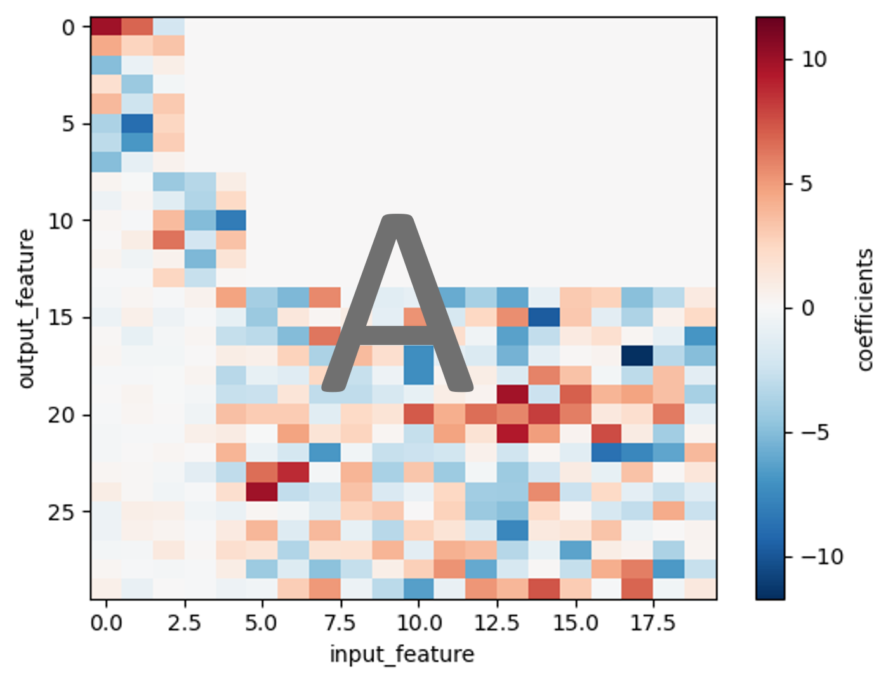

# Parameter Estimation Benchmark Datasets (ds_Sep2_2026)

This file contains synthetic dataset for demonstrating the proj2dsampler methods using a linear model:

\[
Ax = b
\]

  

The dataset includes 300 samples, 20 input parameters, and 30 model outputs. Parameter values range from −1 to 1.
The matrix A is visualized above. Parameters 0-2 dominate Outputs 0-7; Parameters 2-4 dominate Outputs 8-13. The rest variables are dominated by the rest parameters. This design is similar to what is commonly seen in the sensitivity map of climate model PPEs. 

## Dataset Contents

Each dataset contains:

- `X.csv` — sampled parameter values
- `x_true.csv` — ground-truth parameter vector <---- The answer
- `Y.csv` — simulated model outputs
- `y_true.csv` — ground-truth observation vector
- `.nc` file — complete dataset, including the above 4 elements, the coefficient matrix A and other useful information. 

## Dataset Dimensions

| Variable | Dimensions | Description |
|---|---|---|
| `X` | `(sample, input_feature)` | Sampled input parameters |
| `Y` | `(sample, output_feature)` | Corresponding model outputs |
| `x_true` | `(input_feature)` | Ground-truth parameter values |
| `y_true` | `(output_feature)` | Ground-truth model output |
| `coefficients` | `(input_feature, output_feature)` | Linear-model coefficients (A) |

## Dataset Configuration

- **Model:** Linear model (`Ax = b`)
- **Samples:** 300
- **Input parameters:** 20
- **Model outputs:** 30
- **Parameter range:** −1 to 1

These datasets are intended for testing the method in the case the inputs are provided as csv tables.
